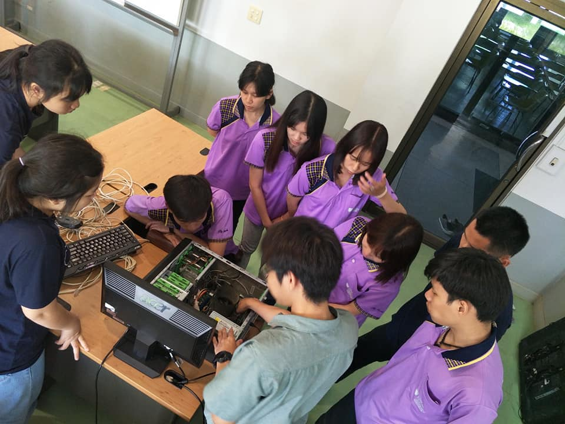

<html>
<meta name="viewport" content="width=device-width, initial-scale=1" />
<body>
    

              
  

</body>
</html>

<h2 id="welcome-to-my-profile">Welcome To My Profile</h2>

ชื่อ-สกุล : นางสาว พัชริดา  เจริญผล

ชื่อเล่น : แพรว

ปัจจุบันศึกษาอยู่ที่มหาวิทยาลัยเนชั่น

คณะบริหารธุรกิจและรัฐประศาสนศาสตร์

สาขาวิทยาการคอมพิวเตอร์ ชั้นปีที่ 3

<h3 id="36-pyramid">36 Pyramid</h3>

<a href="https://github.com/praew06/php_pyramid/blob/master/Praew_01.php" class="button">pyramid01</a>
<a href="https://github.com/praew06/php_pyramid/blob/master/Praew_02.php" class="button">pyramid02</a>
<a href="https://github.com/praew06/php_pyramid/blob/master/Praew_03.php" class="button">pyramid03</a>
<a href="https://github.com/praew06/php_pyramid/blob/master/Praew_04.php" class="button">pyramid04</a>
<a href="https://github.com/praew06/php_pyramid/blob/master/Praew_05.php" class="button">pyramid05</a>

<a href="https://github.com/praew06/php_pyramid/blob/master/Praew_06.php" class="button">pyramid06</a>
<a href="https://github.com/praew06/php_pyramid/blob/master/Praew_07.php" class="button">pyramid07</a>
<a href="https://github.com/praew06/php_pyramid/blob/master/Praew_08.php" class="button">pyramid08</a>
<a href="https://github.com/praew06/php_pyramid/blob/master/Praew_09.php" class="button">pyramid09</a>
<a href="https://github.com/praew06/php_pyramid/blob/master/Praew_10.php" class="button">pyramid10</a>

<a href="https://github.com/praew06/php_pyramid/blob/master/Praew_11.php" class="button">pyramid11</a>
<a href="https://github.com/praew06/php_pyramid/blob/master/Praew_12.php" class="button">pyramid12</a>
<a href="https://github.com/praew06/php_pyramid/blob/master/Praew_13.php" class="button">pyramid13</a>
<a href="https://github.com/praew06/php_pyramid/blob/master/Praew_14.php" class="button">pyramid14</a>
<a href="https://github.com/praew06/php_pyramid/blob/master/Praew_15.php" class="button">pyramid15</a>

<a href="https://github.com/praew06/php_pyramid/blob/master/Praew_16.php" class="button">pyramid16</a>
<a href="https://github.com/praew06/php_pyramid/blob/master/Praew_17.php" class="button">pyramid17</a>
<a href="https://github.com/praew06/php_pyramid/blob/master/Praew_18.php" class="button">pyramid18</a>
<a href="https://github.com/praew06/php_pyramid/blob/master/Praew_19.php" class="button">pyramid19</a>
<a href="https://github.com/praew06/php_pyramid/blob/master/Praew_20.php" class="button">pyramid20</a>

<a href="https://github.com/praew06/php_pyramid/blob/master/Praew_21.php" class="button">pyramid21</a>
<a href="https://github.com/praew06/php_pyramid/blob/master/Praew_22.php" class="button">pyramid22</a>
<a href="https://github.com/praew06/php_pyramid/blob/master/Praew_23.php" class="button">pyramid23</a>
<a href="https://github.com/praew06/php_pyramid/blob/master/Praew_24.php" class="button">pyramid24</a>
<a href="https://github.com/praew06/php_pyramid/blob/master/Praew_25.php" class="button">pyramid25</a>

<a href="https://github.com/praew06/php_pyramid/blob/master/Praew_26.php" class="button">pyramid26</a>
<a href="https://github.com/praew06/php_pyramid/blob/master/Praew_27.php" class="button">pyramid27</a>
<a href="https://github.com/praew06/php_pyramid/blob/master/Praew_28.php" class="button">pyramid28</a>
<a href="https://github.com/praew06/php_pyramid/blob/master/Praew_29.php" class="button">pyramid29</a>
<a href="https://github.com/praew06/php_pyramid/blob/master/Praew_30.php" class="button">pyramid30</a>

<a href="https://github.com/praew06/php_pyramid/blob/master/Praew_31.php" class="button">pyramid31</a>
<a href="https://github.com/praew06/php_pyramid/blob/master/Praew_32.php" class="button">pyramid32</a>
<a href="https://github.com/praew06/php_pyramid/blob/master/Praew_33.php" class="button">pyramid33</a>
<a href="https://github.com/praew06/php_pyramid/blob/master/Praew_34.php.php" class="button">pyramid34</a>
<a href="https://github.com/praew06/php_pyramid/blob/master/Praew_35.php" class="button">pyramid35</a>

<a href="https://github.com/praew06/php_pyramid/blob/master/Praew_36.php" class="button">pyramid36</a>

<h3 id="free-web-host">Free web host</h3>

<a href="https://fafearn89.000webhostapp.com/">000webhost</a> 
 <a href="https://Myfearn89.epizy.com">infinity</a>

<h3 id="ข้อมูลจาก-8-ตาราง"><a href="https://github.com/praew06/8_Nortwind/blob/master/products.sql">ข้อมูลจาก 8 ตาราง</a></h3>

<h3 id="64-โปรแกรม-ซึ่งประกอบด้วย-8-ตาราง-nortwind"><a href="https://github.com/praew06/8_Nortwind">64 โปรแกรม</a> ซึ่งประกอบด้วย 8 ตาราง Nortwind</h3>

<h3 id="midterm-project-"><a href="https://github.com/praew06/midterm_php">Midterm Project </a></h3>

<h3 id="free-web-host">Free web host</h3>

<a href="https://patcharida006.000webhostapp.com">000webhost</a> 
 <a href="https://Patcarida.epizy.com">infinity</a>

     
